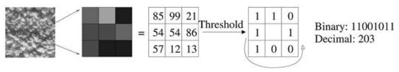
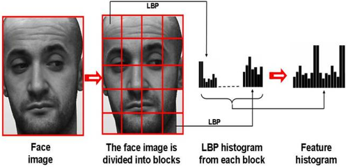

# LBP_SVM_Classifier
using Local Binary Pattern, SVM to classifying image. Sub Detector for YOLO v3

opencv v3 (opencv world 310)

with visual studio 2013. build project

------
1. LBP feature

2. LBP feature histogram

